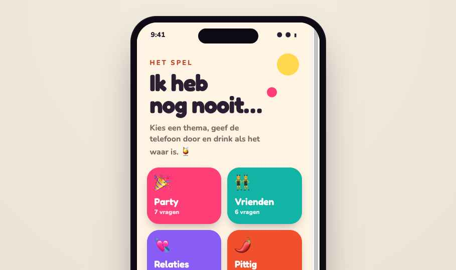

# Ik heb nog nooit… 🍸

Een vrolijk **Never Have I Ever**-drankspel (NL). Kies een thema, geef de telefoon door en
**drink als het waar is**. Veel vragen, een instelbaar pittigheidsniveau, een combi-modus die
alle thema's mixt, en je eigen vragen. Draait als **web-app op je telefoon** (offline, geen
app store).



## Zo werkt het
1. Kies een **thema** (of tik **🎲 Verras me** voor alle thema's door elkaar).
2. Lees de kaart voor: *"Ik heb nog nooit …"*.
3. Wie het **wél** heeft gedaan, neemt een slok. 🍸
4. Tik de kaart of **Volgende →** voor de volgende vraag.

## Features
- **11 thema's**, ~45 vragen elk (~450 in totaal): Party, Vrienden, Relaties, Pittig, Reizen,
  Werk, Dronken, Gênant, Vroeger, Foute boel + **Eigen vragen**.
- **Niveau-filter**: *Netjes* (collega-safe) · *Pittig* · *Alles* (18+). Zet 'm netjes voor
  op werk, wild met vrienden.
- **Combi-modus**: alle thema's door elkaar, kleur/emoji wisselt per kaart.
- **Geen herhaling**: binnen een ronde komt elke vraag maar één keer.
- **Eigen vragen**: verzin je eigen "Ik heb nog nooit…", blijven op je telefoon bewaard en
  spelen mee (ook in de combi-modus).
- **Offline & installeerbaar** (PWA): na één keer laden werkt het zonder internet, ideaal op
  een feestje met slechte wifi.

## Op je telefoon zetten
Zodra de app online staat (zie *Deployen* hieronder), open je de link op je telefoon:
- **iPhone (Safari):** deel-knop → **Zet op beginscherm**.
- **Android (Chrome):** menu (⋮) → **App installeren** / **Toevoegen aan startscherm**.

Daarna staat 'ie als een echt app-icoontje op je scherm en werkt 'ie offline. Delen met
vrienden = gewoon de link doorsturen.

## Lokaal testen (op je Mac)
De app gebruikt een service worker, dus je hebt een klein servertje nodig (dubbelklikken op
`index.html` werkt níét):
```bash
cd ~/Projects/NeverEver-game
python3 -m http.server 8000
# open daarna http://localhost:8000
```

## Vragen toevoegen of aanpassen
Alle vragen staan in **`data/questions.js`**. Kopieer een regel bij het juiste thema:
```js
{ text: "op een tafel gedanst.", level: 1 },
```
- De tekst maakt de zin *"Ik heb nog nooit …"* af.
- `level`: **1** = netjes · **2** = pittig · **3** = wild/18+.

Geen build nodig — opslaan en de pagina herladen. Heb je de app al gedeployd? Verhoog dan
`CACHE = "ihnn-v1"` naar `"ihnn-v2"` in **`service-worker.js`** zodat telefoons de nieuwe
versie ophalen.

## Deployen naar GitHub Pages (gratis hosting)
De app is statisch, dus GitHub Pages host 'm gratis. Eenmalig instellen:

**Optie A — met de `gh` CLI (als je ingelogd bent):**
```bash
cd ~/Projects/NeverEver-game
gh repo create never-have-i-ever --public --source=. --push
gh api -X POST repos/{owner}/never-have-i-ever/pages -f source[branch]=main -f source[path]=/
```
**Optie B — handmatig:**
1. Maak een nieuwe repo aan op [github.com/new](https://github.com/new) (bijv.
   `never-have-i-ever`, public).
2. Push je code:
   ```bash
   cd ~/Projects/NeverEver-game
   git remote add origin https://github.com/<jouw-naam>/never-have-i-ever.git
   git push -u origin main
   ```
3. Repo → **Settings** → **Pages** → *Build and deployment* → **Deploy from a branch** →
   branch `main`, map `/ (root)` → **Save**.
4. Na ~1 minuut staat de app op `https://<jouw-naam>.github.io/never-have-i-ever/`.
   Open die link op je telefoon en zet 'm op je beginscherm.

## Techniek
Vanilla **HTML + CSS + JS**, geen framework en geen build-stap — bewust simpel, zodat het
makkelijk te hosten en te onderhouden is. PWA via `manifest.webmanifest` + `service-worker.js`.
Fonts (Fredoka + Nunito) zijn **lokaal** meegeleverd voor een betrouwbare offline-look.

| Bestand | Wat |
|---|---|
| `index.html` | App-shell + 3 views (thema's, spel, eigen vragen) |
| `styles.css` | Design tokens (CSS-variabelen) + styling |
| `app.js` | Spellogica, filter, eigen vragen, service worker |
| `data/questions.js` | Alle thema's + vragen — **hier voeg je vragen toe** |
| `manifest.webmanifest`, `service-worker.js` | PWA / offline |
| `fonts/`, `icons/` | Lettertypes en app-icoon |

## Design
Het oorspronkelijke ontwerp staat in `Never Have I Ever.dc.html` (prototype) en `DESIGN.md`
(de volledige design-spec met alle tokens). De schermen zie je in `screenshots/`.
